# REUMLAB
# MELIQ MVP
## 유사 프로젝트 구축 사례

---

름랩(REUMLAB)은 사용자 화면만 제작하는 방식이 아니라, **회원·Backend·Database·Admin을 함께 구성하여 실제 운영 가능한 Web/Mobile 서비스**를 구축해 왔습니다.

본 문서는 MELIQ MVP 제안에 앞서, 당사가 수행한 프로젝트 3건을 **실제 소스코드·데이터베이스 스키마·API 정의 기준**으로 정리한 것입니다. 각 항목은 저장소 내 파일 경로로 근거를 확인할 수 있으며, 코드에서 확인되지 않은 기능·성과는 기재하지 않았습니다.

**수록 화면 안내** — 본 문서의 모든 캡처는 로컬 실행 환경에서 각 제품의 **데모·픽스처 데이터**로 촬영했습니다. 운영 데이터베이스에 접속하거나 실제 회원 정보를 노출한 화면은 없습니다.

---

## 01. 학우너 (Hakwooner)

### 프로젝트 개요

학원 검색·상담 신청을 제공하는 **학부모·학생용 모바일 앱**과, 학원 원장이 원생·수업·수납·인사를 관리하는 **원장용 ERP**를 하나의 데이터베이스 위에서 운영하는 플랫폼입니다. 소비자 서비스와 사업자 운영 시스템이 같은 백엔드를 공유하는 양면(two-sided) 구조입니다.

### 름랩 실제 수행 범위

- Flutter 기반 사용자 앱 (Dart 소스 398개 파일)
- Express + TypeScript REST API (`/api/v1` 라우트 모듈 33개)
- Next.js 14 기반 원장 ERP (화면 126개, 서버 API 라우트 300개)
- PostgreSQL 스키마 설계 및 마이그레이션 운영 (마이그레이션 310개 / 테이블 222개)
- Row Level Security 정책 설계 (RLS 적용 237회, 정책 459건)
- 결제·구독·정산 연동 (Toss Billing, 에스크로, 세금계산서)

### 주요 구현 기능

| 영역 | 구현 내용 |
|---|---|
| 인증 | Supabase Auth 기반 Bearer 토큰 검증, Kakao·Apple 소셜 로그인(SHA-256 nonce) |
| 권한 | `users.roles text[]` 배열 기반 8개 역할(super_admin·admin·owner·staff·teacher·student·parent·operator), 미들웨어 역할 가드 |
| 추천 | 가중치 기반 학원 추천 엔진 — 거리·과목·목표·수업형태·예산·리뷰 6개 축 가중 합산, 태그 유사도(Jaccard·코사인) 매칭, 0~100 정규화 점수와 추천 사유 문장 자동 생성 |
| 검색 | 위치 기반 학원 검색 RPC, 지오코딩, 지하철역·행정구역 데이터 |
| 운영 | 상담 칸반, 알림톡·SMS 발송 및 수신거부 관리, 감사 로그, 운영자 대시보드 스냅샷 |
| ERP | 원생·출결·성적·시간표·수납·급여·인사평가·SOP·구독 결제 |
| 앱 연동 | 원장이 ERP에서 설정한 학원 정보·수업 상품이 사용자 앱 노출에 반영 |

### 기술스택

Flutter · Dart · Express · TypeScript · Next.js 14 (App Router) · React 18 · PostgreSQL · Supabase (Auth·RLS·Storage) · Prisma · TanStack Query/Table · Tailwind CSS · Sentry · Firebase (Analytics·Crashlytics·Messaging) · Toss Payments · Netlify · Railway · Docker

### 서비스 구조

```
[사용자 앱 (Flutter)]            [원장 ERP (Next.js 14)]         [운영자 콘솔]
        │                                 │                           │
        └───────────┬─────────────────────┴───────────────────────────┘
                    │
        [REST API (Express · /api/v1 · 라우트 33종)]
                    │
        [PostgreSQL · 222 테이블 · RLS 459 정책]
```

### 대표 화면

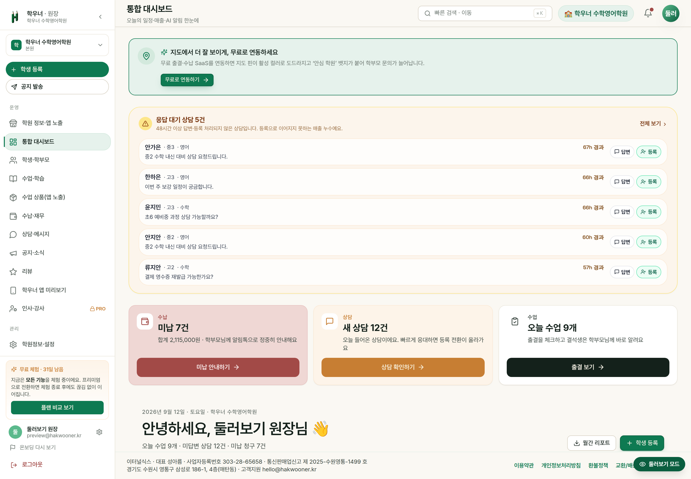

원장이 로그인하면 가장 먼저 보는 통합 대시보드입니다. 미응답 상담, 미납 수납, 당일 수업이 하나의 화면에 모이고 각 항목에서 처리 화면으로 바로 이동합니다. 화면 우측 하단의 '둘러보기 모드' 표시에서 알 수 있듯, 제품에 내장된 읽기 전용 체험 모드로 촬영했습니다.

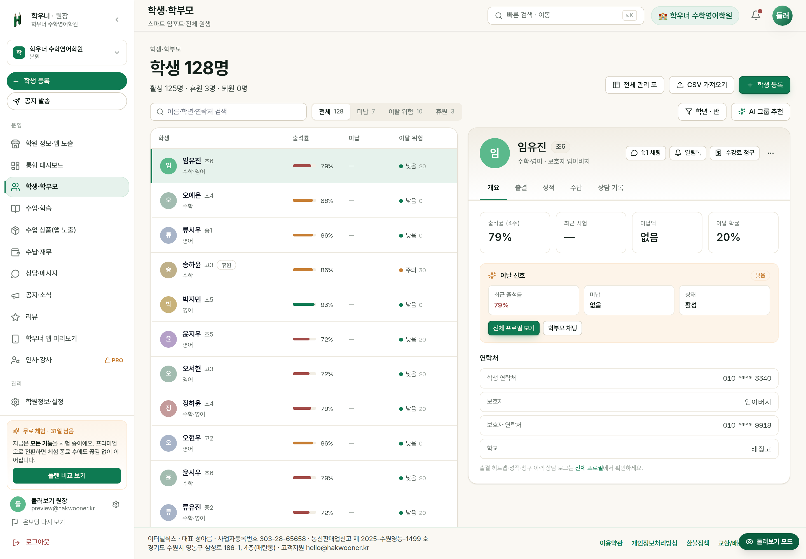

원생 목록과 상세 정보를 한 화면에서 다루는 관리 화면입니다. 출석률·미납·이탈 위험이 목록 단계에서 계산되어 표시되고, 우측 패널에서 개별 원생의 출결·성적·수납·상담 기록으로 넘어갑니다. 연락처는 시스템이 자동으로 마스킹하여 표시합니다.

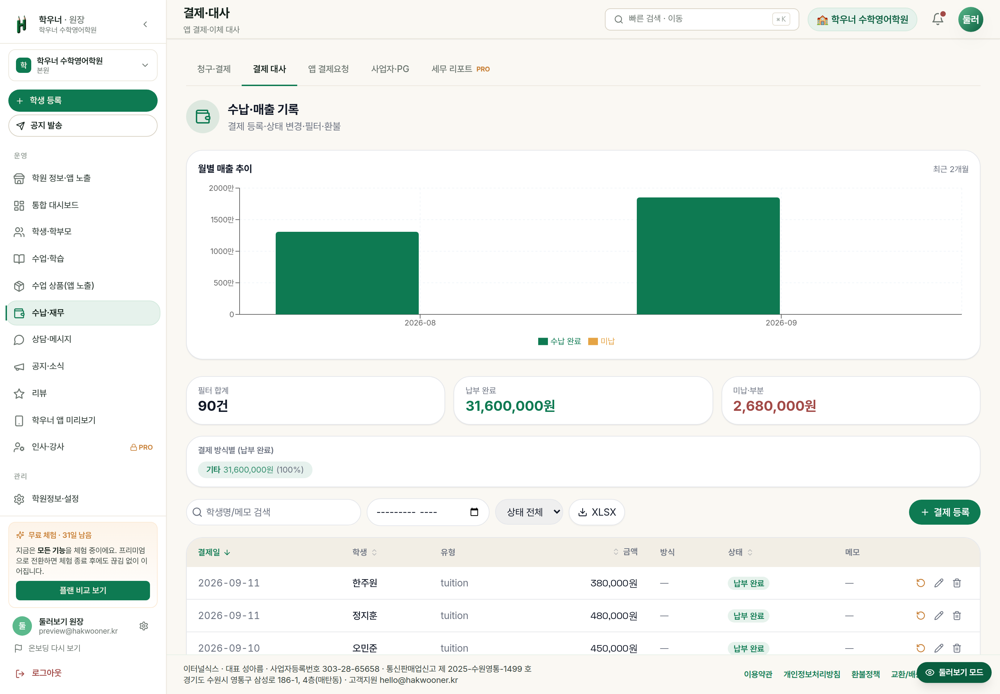

앱 결제와 계좌 이체를 대조하는 수납·재무 화면입니다. 결제 수단이 여러 갈래인 서비스에서 금액이 맞지 않는 건을 운영자가 찾아낼 수 있도록 대사(reconciliation) 흐름을 별도 화면으로 분리했습니다.

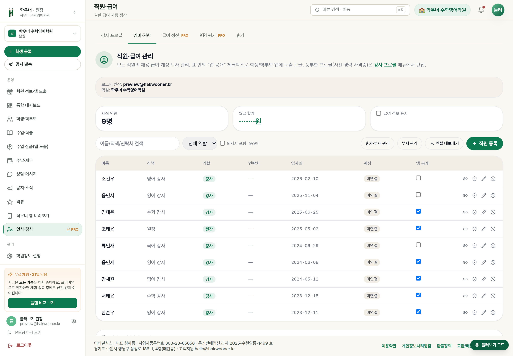

직원 계정과 권한·급여를 다루는 화면입니다. 역할은 데이터베이스의 `users.roles` 배열과 RLS 정책에 연결되어 있어, 화면에서 막는 것과 별개로 데이터 계층에서도 접근이 제한됩니다.

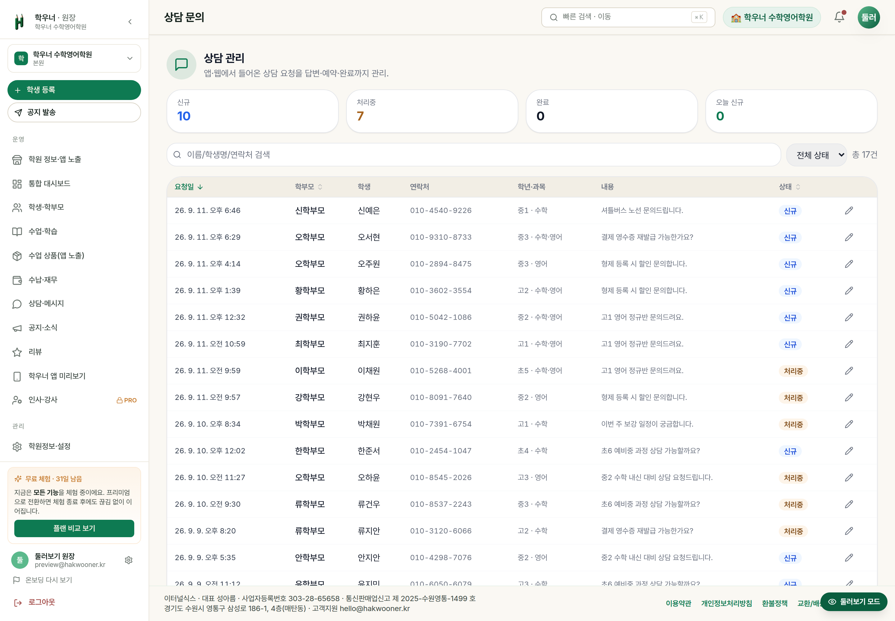

사용자 앱에서 들어온 상담이 원장 화면의 처리 대기열로 이어지는 구간입니다. 앱(소비자)과 ERP(사업자)가 같은 테이블을 공유하기 때문에 별도 연동 없이 상태가 양쪽에 반영됩니다.

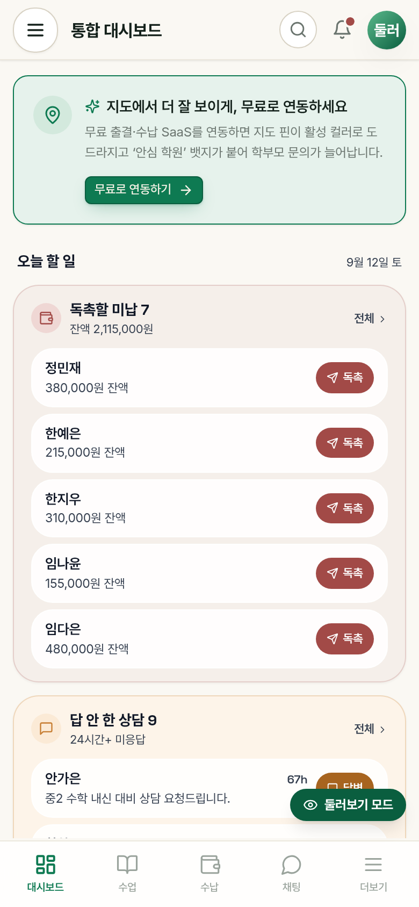

같은 ERP를 390px 폭에서 연 화면입니다. 원장이 현장에서 휴대폰으로 확인하는 경우를 전제로 동일한 데이터와 기능을 유지한 채 레이아웃만 재구성했습니다.

### MELIQ와의 구조적 관련성

MELIQ가 요구하는 **Recommendation Module · Fit Score · Why it fits** 는 학우너에서 이미 동일한 형태로 구현되어 있습니다.

- **규칙 기반 추천 모듈** — 거리·과목·목표·수업형태·예산·리뷰 6개 축에 가중치를 부여해 합산하는 방식입니다. 가중치는 코드 상단 상수로 분리되어 있어 정책 변경 시 재배포만으로 조정됩니다.
- **Fit Score** — 합산 결과를 0~100으로 정규화한 `matchScore`와, 사용자에게 보여줄 `matchLabel`("우리 아이와 XX% 일치")을 함께 반환합니다.
- **Why it fits** — 점수를 만든 각 항목을 사람이 읽을 수 있는 문장으로 되돌려 줍니다. 점수만 보여 주고 끝내지 않고, 왜 그 점수인지를 함께 전달하는 구조입니다.
- **Data Confidence** — 리뷰에서 80% 이상 반복 검증된 태그에만 가중치를 부여합니다. 근거가 약한 신호가 점수를 끌어올리지 않도록 임계값을 둔 설계입니다.
- **Admin ↔ 사용자 서비스 연결** — 원장이 ERP에서 등록·수정한 정보가 사용자 앱 노출에 반영되는 구조로, MELIQ의 Admin Dashboard ↔ Product DB ↔ 사용자 Fit Check 연결과 동일한 흐름입니다.

도메인은 학원이지만, **사용자 입력을 받아 규칙으로 점수화하고 그 근거를 설명한 뒤 결과를 저장하고, 운영자가 관리 화면에서 원천 데이터를 관리하는** 전체 골격이 MELIQ MVP와 그대로 대응됩니다.

---

## 02. VeRoRo

### 프로젝트 개요

반려동물 사료·간식의 **원재료를 분석해 우리 아이 기준의 적합도와 등급으로 환산**해 주는 모바일 우선 서비스입니다. 사용자는 반려동물 프로필(품종·나이·알레르기·건강 우려)을 등록하고, 제품을 검색하거나 바코드를 찍어 개인화된 분석 결과를 받습니다. 운영자는 별도 관리자 콘솔에서 제품·원재료 사전·데이터 품질을 관리합니다.

### 름랩 실제 수행 범위

- React 19 + TypeScript + Vite 기반 모바일 우선 웹 서비스
- 관리자 콘솔 10개 화면 (제품·원재료·미매칭 성분·데이터 품질·회원·대기자·설정)
- PostgreSQL 스키마 설계 (테이블 45개 / 마이그레이션 37개 / RLS 정책 95건)
- 원재료 분석 룰 엔진 및 적합도 산출 로직
- Supabase Edge Function 4종 (관리자 인증·관리자 쓰기·점수 산출·대기자 등록)
- Capacitor를 통한 iOS/Android 패키징, Netlify 배포 및 도메인 경계 분리

### 주요 구현 기능

| 영역 | 구현 내용 |
|---|---|
| 사용자 인증 | Supabase Auth (이메일·OAuth), Kakao 로그인 |
| 관리자 인증 | 사용자 인증과 분리된 별도 체계 — 서버 발급 HMAC 서명 세션, `sessionStorage` 전용, TTL 8시간, 새로고침 시 서버 재검증 |
| 권한 경계 | 관리자 쓰기는 anon 클라이언트로 불가. `admin-write` Edge Function(service_role)만 경유하도록 강제 |
| 제품 DB | 제품·원재료·동의어·알레르겐 매핑·영양 프로파일을 분리한 정규화 스키마 |
| 분석 엔진 | 원재료 품질 등급, 기능성 성분 분류, 영양 공개 수준, 위험 성분 검출, 품종별 질환 규칙, 알레르기 교차반응 계열 매칭 |
| 적합도 | 기준 점수에서 알레르기·교차반응·기호도 감점을 적용해 0~100 산출, A~F 등급 및 판정 문구로 환산 |
| 결과 저장 | 분석 결과·리포트·최근 본 제품·비교함·찜 목록 |
| 데이터 품질 | 미매칭 성분 큐, 제품 보강 큐, 정보 완성도 지표, 관리자 감사 로그 |
| 기타 | 바코드 스캔, 급여 일지, 제품 비교, 출시 대기자 명단 |

### 기술스택

React 19 · TypeScript · Vite 8 · React Router 7 · Zustand · Supabase (PostgreSQL·Auth·RLS·Edge Functions·Storage) · Deno (Edge Functions) · Capacitor (iOS·Android) · Vitest · Playwright · Netlify (Edge Functions 포함)

### 서비스 구조

```
[사용자 웹/앱 (React + Capacitor)]        [관리자 콘솔 (/admin · 별도 도메인)]
        │                                            │
        │ anon (공개 SELECT + RLS)                    │ x-admin-token
        │                                            ▼
        │                            [admin-write Edge Function (service_role)]
        └────────────────┬───────────────────────────┘
                         ▼
        [PostgreSQL · 45 테이블 · RLS 95 정책]
```

### 대표 화면

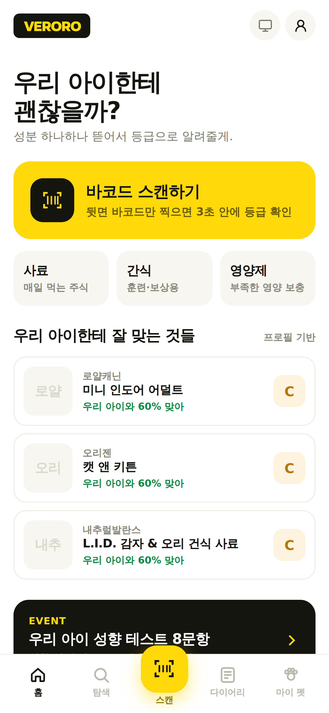

390px 폭 기준으로 설계한 사용자 홈 화면입니다. 바코드 스캔을 최상단 진입점으로 두고, 그 아래에 등록된 반려동물 프로필 기준으로 계산한 적합도("우리 아이와 60% 맞아")와 등급을 제품마다 함께 표시합니다.

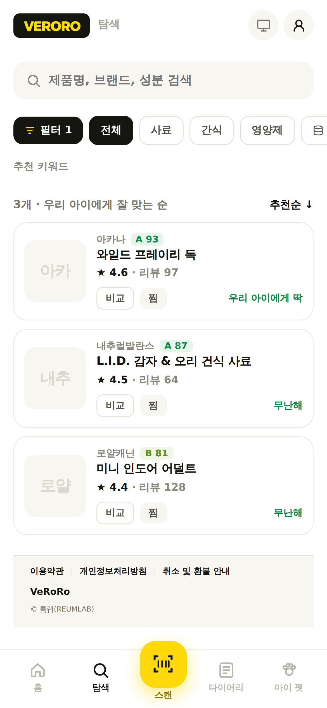

제품 탐색 화면입니다. 목록의 기본 정렬이 '우리 아이에게 잘 맞는 순'이며, 각 제품에 등급과 점수(A 93 / A 87 / B 81), 그리고 '우리 아이에게 딱' · '무난해' 같은 판정 문구가 함께 붙습니다. 카테고리·타깃·성분 필터가 결합됩니다.

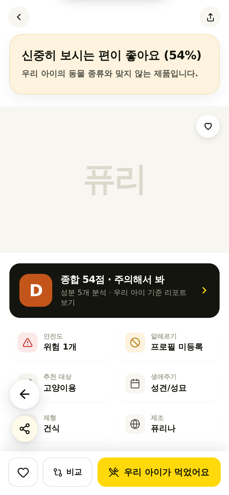

개별 제품의 분석 결과 화면입니다. 상단에 적합도와 판정("신중히 보시는 편이 좋아요 (54%)")을 두고 그 아래 판정 근거를 문장으로 제시합니다. 안전도(위험 성분 검출 수), 알레르기(프로필 미등록 시 그 사실을 그대로 표기), 추천 대상·생애주기·제형·제조사를 항목별로 나눠 보여 줍니다.

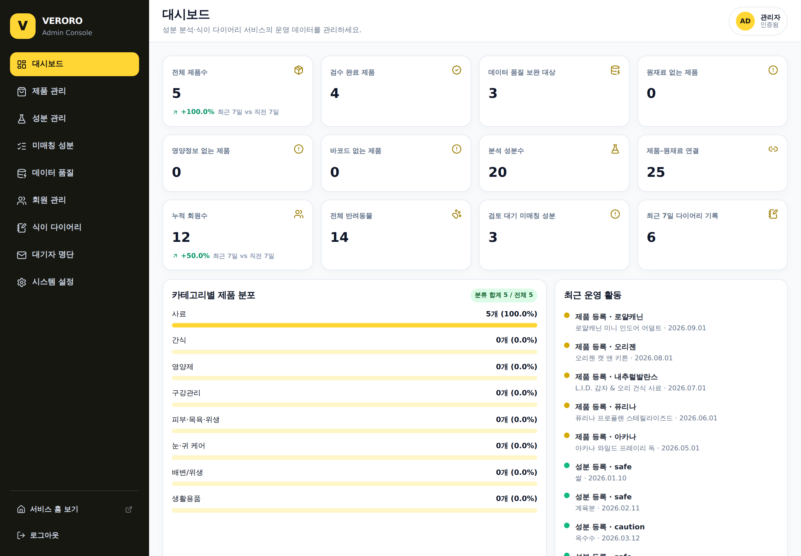

운영자용 관리자 콘솔의 대시보드입니다. 제품 수·검수 완료 수와 함께 **데이터 품질 보완 대상**(원재료 없는 제품, 영양정보 없는 제품, 바코드 없는 제품, 검토 대기 미매칭 성분)을 지표로 노출해, 분석 품질을 떨어뜨리는 결손 데이터를 운영자가 추적할 수 있게 했습니다. 화면의 수치는 로컬 데모 데이터 기준입니다.

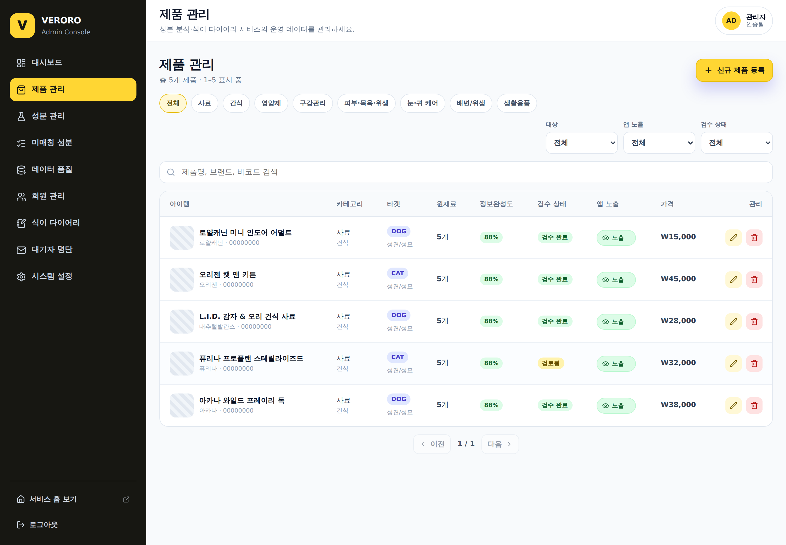

제품 CRUD 화면입니다. 카테고리·대상·앱 노출·검수 상태로 필터링하고, 행마다 원재료 연결 수, 정보 완성도(%), 검수 상태, **앱 노출 여부**를 확인·변경합니다. 관리자가 여기서 노출을 끄면 사용자 서비스 목록에서 즉시 빠집니다.

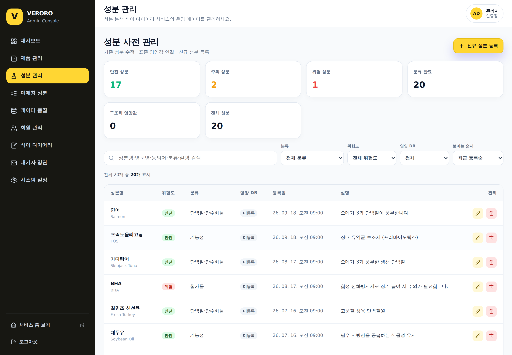

분석 엔진이 참조하는 원재료 사전을 관리하는 화면입니다. 원재료별 위험도(safe·caution·danger), 분류, 별칭, 알레르기 유발 태그, 영양 성분을 편집합니다. 이 사전이 곧 사용자 화면의 적합도 계산 입력이 됩니다.

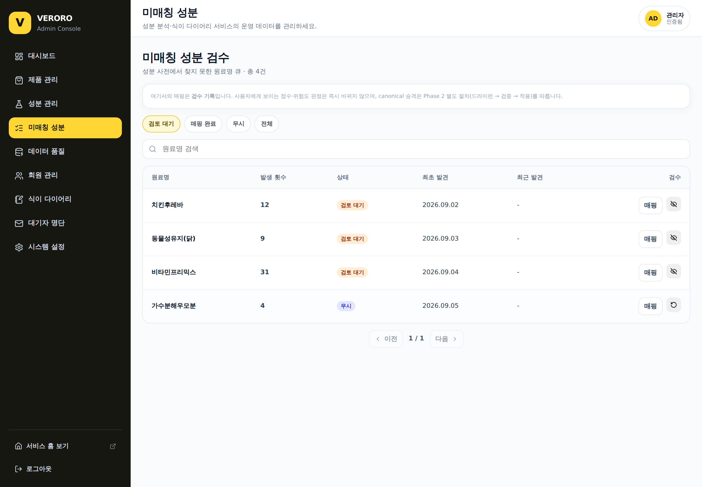

제품 라벨에서 수집됐지만 사전과 매칭되지 않은 성분을 처리하는 큐입니다. 운영자가 기존 원재료에 매핑하거나 무시 처리하면 이후 분석에 반영됩니다. 데이터가 늘어날수록 분석 정확도가 올라가는 운영 루프를 화면으로 만든 부분입니다.

### MELIQ와의 구조적 관련성

VeRoRo는 MELIQ MVP와 **도메인만 다르고 구조가 거의 동일한 사례**입니다.

| MELIQ 요구 | VeRoRo 대응 구현 |
|---|---|
| 사용자 입력 기반 Fit Check | 반려동물 프로필(알레르기·건강 우려·기호도) 입력 → 제품별 재계산 |
| Product DB | 제품·원재료·동의어·알레르겐 매핑·영양 프로파일 정규화 스키마 |
| 규칙 기반 Recommendation Module | 원재료 품질·위험도·질환 규칙·교차반응 계열 매칭으로 구성된 룰 엔진 |
| Risk Filter | 원재료 `risk_level`(safe/caution/danger) 및 제품 위험 요소 플래그로 필터·감점 |
| Fit Score | 0~100 적합도 + A~F 등급 + 판정 문구 |
| Data Confidence | 검수 상태(pending/reviewed/verified), 정보 완성도 %, 프로필 미등록 시 "모른다"를 그대로 표기 |
| Why it fits / What to watch | 감점 사유를 문장으로 반환("교차반응 주의 · N점 감점") |
| 결과 저장 / History | 분석 결과·리포트·최근 본 제품·비교함 |
| Admin Dashboard · Product CRUD | 관리자 콘솔 10화면, 제품·원재료 CRUD, 앱 노출 제어 |
| 사용자 서비스 ↔ 관리자 데이터 연결 | 관리자 등록·검수 → 사용자 앱 노출 및 분석 입력으로 직결 |

특히 MELIQ가 요구하는 **"점수와 함께 근거를 설명하고, 모르는 값은 모른다고 표시한다"** 는 요건은 VeRoRo에서 이미 제품 원칙으로 구현되어 있습니다. 분석 규칙과 점수는 버전·회귀 테스트로 고정해 두어, 규칙을 바꿨을 때 기존 제품의 점수가 의도치 않게 흔들리는지를 검증하는 장치도 함께 갖추고 있습니다.

한편, MELIQ가 요구하는 **Affiliate Click Tracking** 은 VeRoRo에 제휴 링크 필드까지만 구현되어 있고 클릭 집계는 포함되어 있지 않습니다. MELIQ에서는 이 부분을 신규 구현 범위로 산정하고 있습니다.

---

## 03. 세탁 서비스 앱 (A.care)

### 프로젝트 개요

세탁 공장과 거래처(식당·병원·웨딩홀 등) 사이의 **주문–세탁–배송–정산 전 과정을 하나의 시스템으로 운영**하는 B2B 서비스입니다. 거래처는 전용 모바일 앱으로 주문하고, 공장 운영진은 관리자 웹에서 주문 처리·배송 동선·예치금 원장·결제 대사·통계를 관리합니다.

### 름랩 실제 수행 범위

- Flutter 기반 거래처 주문 앱 (Android·iOS, 화면 11개)
- React 19 + Vite 기반 관리자 웹 (화면 12개)
- Express 5 + TypeScript API 서버
- PostgreSQL 스키마 설계 및 마이그레이션 24단계 운영 (테이블 29개)
- 주문 상태 머신 및 트랜잭션 설계
- 역할·권한(RBAC) 매트릭스 설계 (역할 6종 × 권한 31종)
- OpenAPI 기반 앱·관리자·서버 공용 계약 정의 (2,133줄)
- PG(Toss) 결제·예치금 원장·대사 연동

### 주요 구현 기능

| 영역 | 구현 내용 |
|---|---|
| 주문 워크플로 | 수량 입력 → 주문 확인 → 결제 → 접수 → 세탁 → 배송 → 완료 |
| 상태 관리 | 주문 상태 5종(결제대기·주문완료·배송완료·주문취소·결제실패)과 이행 단계 4종(접수·세탁·배송·완료)을 **별도 축**으로 분리, 허용 전이표로 관리 |
| 동시성 | 모든 상태 변경이 단일 서비스를 경유 — 행 잠금(`FOR UPDATE`) → 소유권 확인 → 버전 확인(낙관적 동시성) → 전이 검증 → 업무조건 검증 → 원장 처리 → 이력 기록 → 커밋 |
| 멱등성 | 취소·결제에 멱등 키를 두어 중복 요청이 원장에 두 번 반영되지 않도록 보장 |
| 이력 | 주문 상태 이력, 관리자 감사 로그, 로그인 로그, 설정 변경 이력, 반출 로그 |
| 권한 | 역할 6종 × 권한 31종 매트릭스. 서버가 권한 판정의 정본이고 프런트 가드는 UX용. 알 수 없는 역할은 거부 |
| 개인정보 보호 | 거래처 명부·주문 엑셀 등 **대량 반출 권한을 조회 권한과 분리**(`vendor.export`, `order.export`) |
| 인증 보안 | 세션 토큰은 해시로 저장하고 상수 시간 비교, IP·계정 단위 로그인 제한과 잠금, 유휴 자동 로그아웃 |
| 정산 | 예치금 원장(충전·차감·취소 복원·관리자 보정·결제 취소), 거래처 잔액, 단가 시트 |
| 결제 | Toss PG 연동, 웹훅 수신, 승인·취소 대사, 예치금 반영 상태 추적 |
| 운영 | 배송 동선 정렬, 거래처별 마감 시각 정책, 출력 미리보기, 기간별 통계·엑셀 반출 |

### 기술스택

Flutter · Dart · React 19 · TypeScript · Vite 6 · React Router 8 · Express 5 · node-postgres · Zod · JWT · PostgreSQL · MSW · Vitest · Playwright · Netlify · Railway · Docker Compose

### 서비스 구조

```
[거래처 주문 앱 (Flutter)]              [관리자 웹 (React · 권한별 12화면)]
        │                                        │
        └──────────────┬─────────────────────────┘
                       ▼
        [API 서버 (Express 5 · OpenAPI 2,133줄 공용 계약)]
                       │
        [상태 전이 서비스 — 모든 주문 상태 변경의 단일 통로]
                       │
        [PostgreSQL · 29 테이블 · 24단계 마이그레이션]
```

### 대표 화면

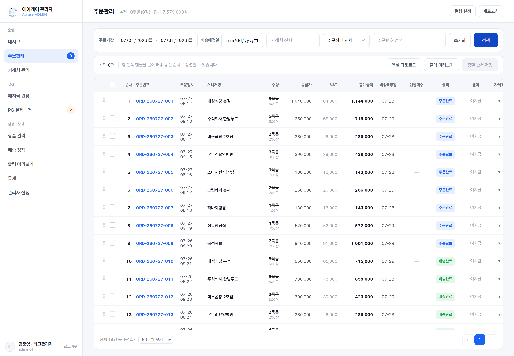

공장 운영진이 하루 업무를 처리하는 핵심 화면입니다. 기간·거래처·주문상태로 조회하고, 각 행에서 수량·공급가·VAT·합계·배송예정일·상태·결제수단을 확인합니다. 행 왼쪽 핸들을 끌어 **배송 동선 순서**를 지정할 수 있으며, 순서는 배송예정일 단위로 저장됩니다.

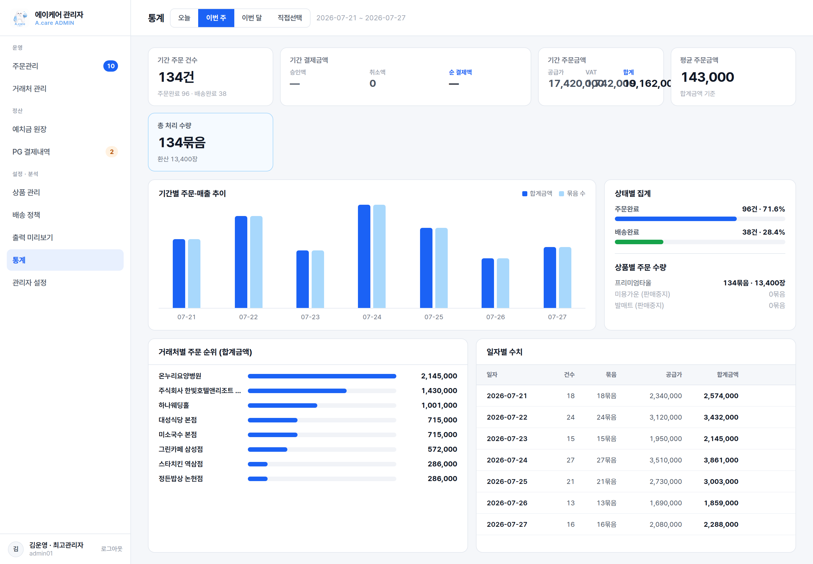

기간별 주문 건수·결제금액·주문금액을 집계하는 통계 화면입니다. 통계 수치가 주문 목록의 요약과 항상 같은 값을 내도록 필터 로직을 공유하게 설계했습니다. 운영자가 두 화면에서 다른 숫자를 보고 혼란을 겪지 않도록 하기 위한 조치입니다.

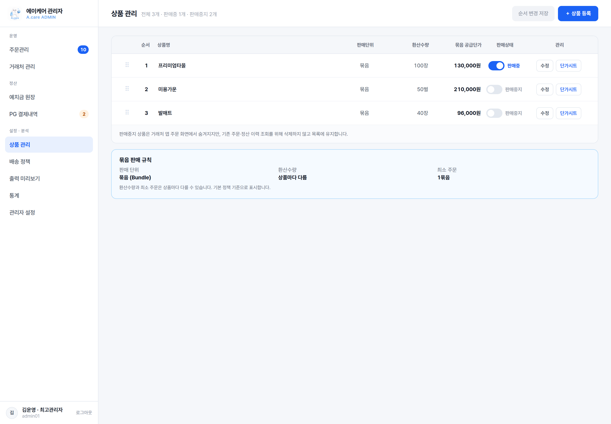

상품과 판매 단위·환산 수량·공급 단가·판매 상태를 관리하는 CRUD 화면입니다. 노출 순서를 드래그로 변경하고, 거래처별 단가 시트를 따로 관리합니다. 상품관리자 역할은 이 화면만 수정할 수 있고 주문·예치금은 조회만 가능합니다.

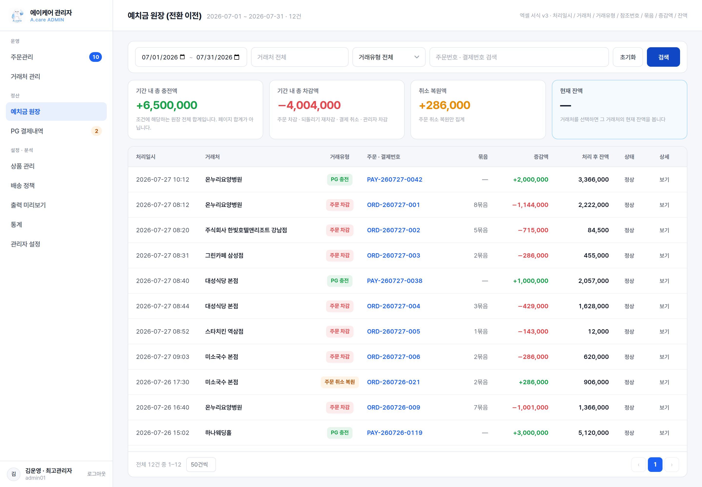

거래처 예치금의 증감을 거래유형별로 추적하는 원장 화면입니다. PG 충전·주문 차감·주문 취소 복원·취소 되돌리기 재차감·관리자 보정(증액/차감)·결제 취소로 유형을 구분하고, 각 행에 참조번호와 처리 후 잔액을 남깁니다.

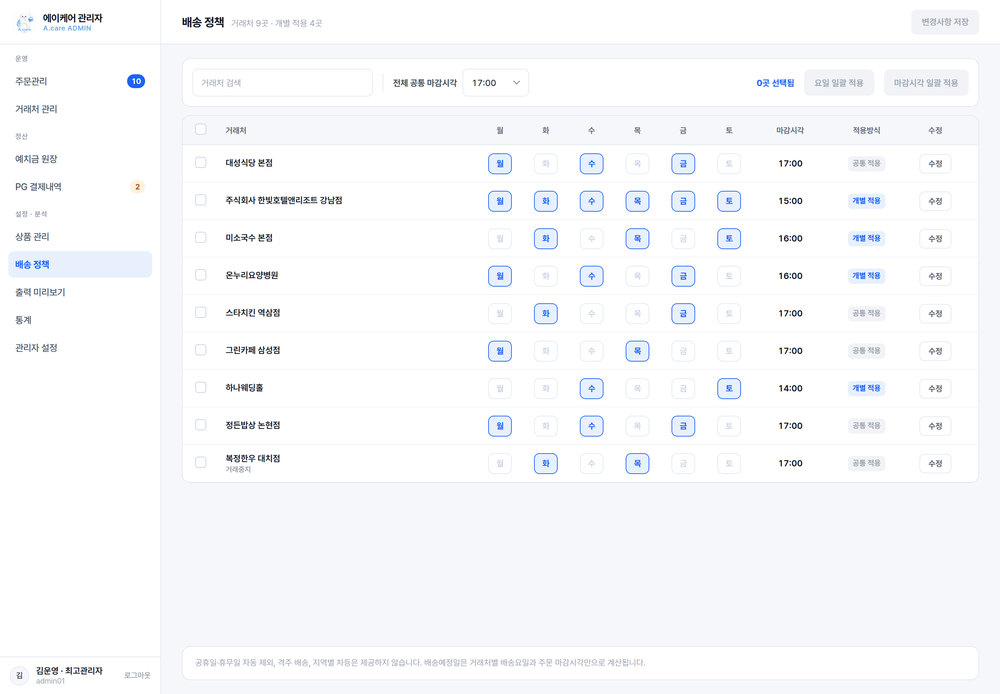

거래처별 주문 마감 시각과 배송 요일을 관리하는 운영 화면입니다. 전체 공통 정책과 거래처별 개별 적용을 함께 지원하며, 마감 시각은 주문 취소 가능 시점과 연결됩니다.

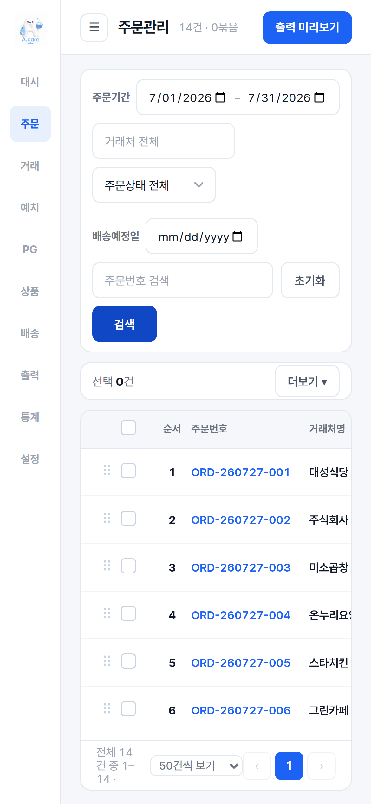

같은 주문 관리 화면을 390px 폭에서 연 모습입니다. 관리자 웹은 매장 노트북과 태블릿 사용을 전제로 5개 폭(768·1024·1054·1280·1440px)에서 레이아웃 결함을 실제 브라우저로 자동 검사하도록 구성했습니다.

### MELIQ와의 구조적 관련성

세탁앱에는 추천 기능이 없습니다. 이 사례가 MELIQ와 맞닿는 지점은 **운영 가능한 SaaS 구조를 실제로 만들어 본 경험**입니다.

- **Mobile-first + Structured User Flow** — 거래처는 모바일 앱으로만 주문합니다. 수량 입력부터 완료까지의 단계를 화면으로 쪼개고 각 단계의 상태를 데이터로 정의했습니다. MELIQ의 Fit Check 입력 흐름과 같은 종류의 설계 문제입니다.
- **Status / History** — 상태를 임의로 바꾸지 않고 허용 전이표로 관리하며, 모든 변경이 단일 통로를 지나 이력으로 남습니다. MELIQ의 결과 저장·History 요건에 그대로 적용할 수 있는 구조입니다.
- **Auth / Role / Permission** — 역할 6종과 권한 31종을 매트릭스 한 곳에서 결정하고, 서버를 권한 판정의 정본으로 둡니다. MELIQ의 Admin Dashboard 권한 분리에 필요한 설계입니다.
- **개인정보 취급 분리** — 한 건을 화면에서 보는 것과 전체를 파일로 반출하는 것을 다른 권한으로 분리했습니다. 미국 소비자 데이터를 다루는 MELIQ에서도 동일한 원칙이 필요합니다.
- **사용자 ↔ 운영자 데이터 연결** — 앱에서 발생한 주문이 관리자 화면의 처리 대상이 되고, 처리 결과가 다시 앱의 주문 이력에 반영됩니다.
- **앱·관리자·서버 공용 계약** — OpenAPI와 enum 정의를 공용 계약으로 두어 세 구성요소가 같은 값·같은 이름을 쓰도록 강제했습니다.

---

## 04. MELIQ 관련 구축 경험 비교표

실제 코드·스키마·설정에서 확인된 사항만 표기했습니다.
**● 확인 · △ 부분 확인 · — 확인 안 됨**

| 기능 | 학우너 | VeRoRo | 세탁앱 |
|---|:---:|:---:|:---:|
| Mobile / Responsive | ● | ● | ● |
| 회원 / Auth | ● | ● | ● |
| User Data | ● | ● | ● |
| Structured DB | ● | ● | ● |
| Backend / API | ● | △ | ● |
| Admin Dashboard | ● | ● | ● |
| CRUD | ● | ● | ● |
| Role / Permission | ● | △ | ● |
| Workflow / Status | ● | △ | ● |
| History | ● | ● | ● |
| Analytics | ● | — | ● |
| Deployment | ● | ● | ● |

### 표기 근거

| 항목 | 학우너 | VeRoRo | 세탁앱 |
|---|---|---|---|
| Mobile / Responsive | Flutter 앱 | 모바일 우선 웹 + Capacitor 패키징 | Flutter 앱 + 관리자 웹 5개 폭 반응형 검사 |
| 회원 / Auth | Supabase Auth + Kakao·Apple | Supabase Auth + Kakao / 관리자 별도 서명 세션 | 자체 세션(토큰 해시 저장·상수시간 비교·로그인 제한) |
| User Data | 학생·학부모 프로필, 설문, 태그 | 반려동물 프로필, 알레르기 프로필, 급여 일지 | 거래처 계정·잔액·단가 |
| Structured DB | 222 테이블 / 310 마이그레이션 | 45 테이블 / 37 마이그레이션 | 29 테이블 / 24 마이그레이션 |
| Backend / API | Express `/api/v1` 33 라우트 + Next 서버 라우트 300 | Supabase + Edge Function 4종 (전용 API 서버 없음 → △) | Express 5 + OpenAPI 2,133줄 |
| Admin Dashboard | ERP 126 화면 | 관리자 콘솔 10 화면 | 관리자 웹 12 화면 |
| CRUD | 원생·수업·상품·직원 | 제품·원재료·미매칭 성분 | 상품·거래처·배송정책 |
| Role / Permission | 8 역할 + RLS 459 정책 | 관리자/사용자 2계층 + RLS 95 정책 (세분 역할 없음 → △) | 6 역할 × 31 권한 매트릭스 |
| Workflow / Status | 상담 처리 흐름, 구독·결제 상태 | 검수 상태·보강 큐 (상태 머신 없음 → △) | 주문 상태 5종 × 이행 단계 4종 + 허용 전이표 |
| History | 추천 결과, 감사 로그, 활동 로그 | 분석 결과·리포트·최근 본 제품 | 주문 상태 이력·감사 로그·반출 로그 |
| Analytics | Firebase Analytics + 운영 스냅샷 테이블 | 분석 SDK 미검출 | 기간별 통계 서비스 + 엑셀 반출 |
| Deployment | Netlify · Railway · Docker | Netlify (Edge Functions 포함) | Netlify · Railway · Docker Compose |

---

## 05. MELIQ MVP 적용 방향

세 프로젝트에서 확인된 구축 경험을 MELIQ 요구 구조에 대응시키면 다음과 같습니다.

| MELIQ 요구 | 적용 가능한 기존 경험 |
|---|---|
| 회원가입·로그인·사용자 데이터 | 3개 프로젝트 모두에서 인증·세션·프로필 스키마를 직접 구축 |
| Mobile-first Responsive Web | VeRoRo(모바일 우선 웹), 세탁앱(다중 폭 반응형 자동 검사) |
| Fit Check 입력 흐름 | VeRoRo 반려동물 프로필 6단계, 세탁앱 단계별 주문 흐름 |
| Product DB | VeRoRo 제품·원재료 정규화 스키마 및 데이터 품질 운영 |
| 규칙 기반 Recommendation Module | 학우너 가중치 추천 엔진, VeRoRo 룰 기반 분석 엔진 |
| Risk Filter | VeRoRo 원재료 위험도 등급 및 위험 요소 플래그 |
| Fit Score | 학우너 0~100 정규화 점수, VeRoRo 적합도·등급 |
| Data Confidence | 학우너 리뷰 검증 임계값, VeRoRo 검수 상태·정보 완성도 |
| Why it fits / What to watch | 학우너 추천 사유 생성, VeRoRo 감점 사유 문장화 |
| 결과 저장 / History | 3개 프로젝트 모두 결과·이력 테이블 운영 |
| Affiliate Click Tracking | **신규 구현 범위** (VeRoRo는 링크 필드까지만 보유) |
| Feedback | 학우너·VeRoRo 리뷰 및 구조화 응답 |
| Analytics | 학우너 Firebase Analytics·운영 스냅샷, 세탁앱 통계 서비스 |
| Admin Dashboard · Product CRUD | 3개 프로젝트 모두 운영자 관리 화면 구축 |
| Auth / Role / Permission | 세탁앱 역할×권한 매트릭스, 학우너 RLS 정책 |
| Backend / API · 관계형 DB | 학우너·세탁앱 REST API 및 PostgreSQL 스키마 운영 |
| 사용자 서비스 ↔ 관리자 데이터 연결 | 3개 프로젝트 모두 동일 DB 기반 양방향 반영 구조 |

MELIQ에서는 위 경험을 기반으로 **Mobile-first 사용자 서비스, Product/User DB, Recommendation Module, Admin Dashboard를 각각 독립된 구성요소로 분리하여**, 규칙과 가중치를 코드 배포 없이 조정할 수 있고 이후 확장·운영이 가능한 구조로 구현할 수 있습니다.

---

<sub>본 문서의 모든 기술 사항은 2026-09-12 기준 각 저장소의 소스코드·데이터베이스 마이그레이션·API 정의를 직접 확인하여 작성했습니다. 수록 화면은 로컬 실행 환경의 데모·픽스처 데이터이며, 운영 데이터·실제 회원 정보는 포함되어 있지 않습니다.</sub>

<sub>REUMLAB · 름랩</sub>
